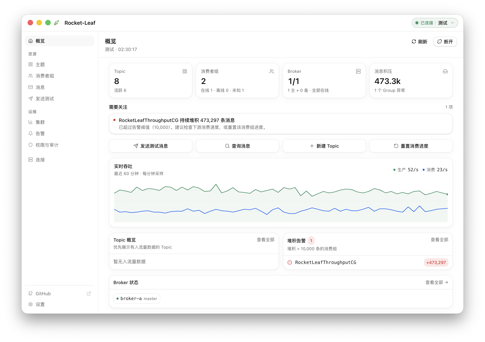
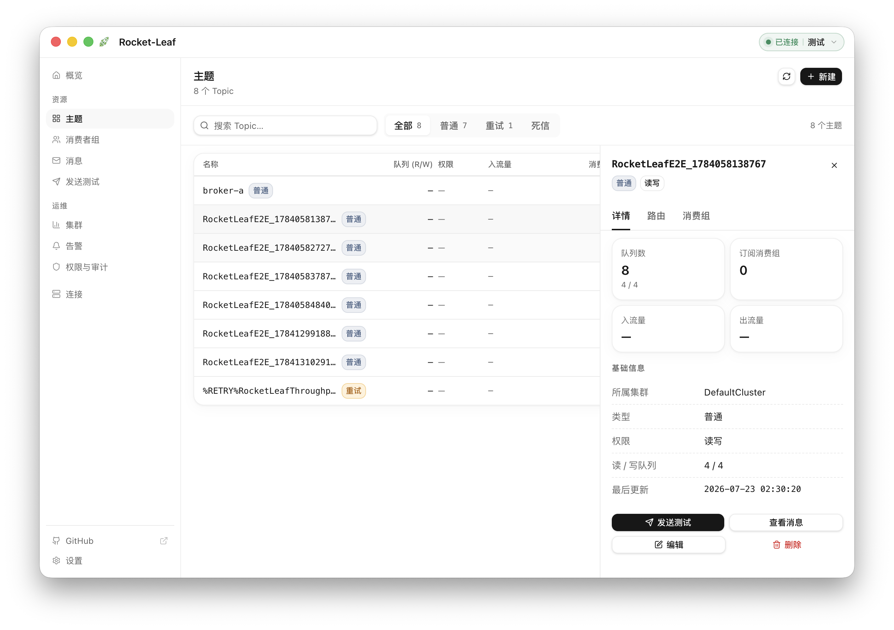
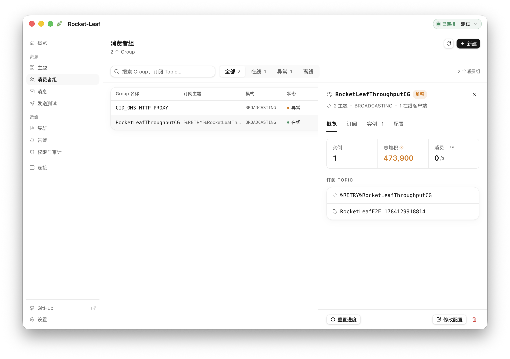
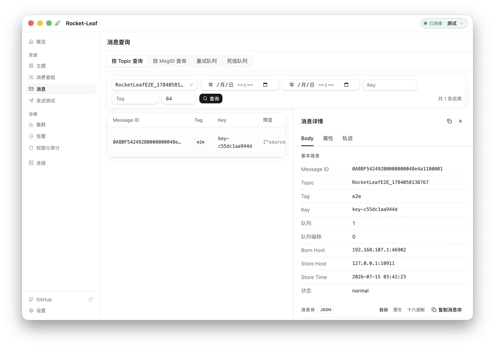
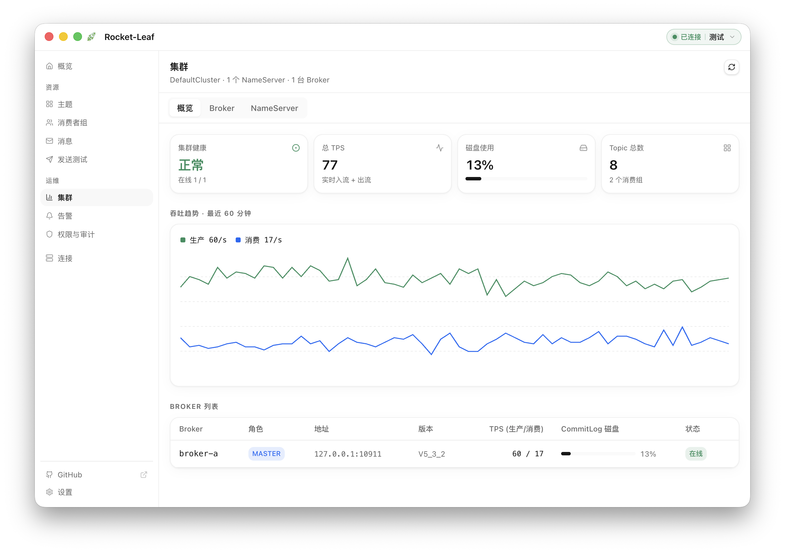

# MQ Studio

<p align="center">
  
</p>

<p align="center">
  <strong>A local-first desktop client for message queues</strong><br>
  Manage clusters, topics, queues, consumers, and messages without deploying a separate console.
</p>

<p align="center">
  <a href="https://github.com/amigoer/mq-studio/releases/latest"></a>
  <a href="https://github.com/amigoer/mq-studio/releases"></a>
  <a href="LICENSE"></a>
  
  
  
</p>

<p align="center">
  <a href="README.zh-CN.md">简体中文</a> ·
  <a href="https://github.com/amigoer/mq-studio/releases">Download</a> ·
  <a href="docs/ARCHITECTURE.md">Documentation</a>
</p>

---

<p align="center">
  <a href="docs/images/overview.png">
    
  </a>
  <br>
  <sub>Live cluster health, throughput, consumer lag, and broker status in one view.</sub>
</p>

## Why MQ Studio?

- **Ready to use** — no server or web console to deploy
- **Built for daily operations** — everyday message queue tasks in one desktop app
- **Private by default** — configuration stays on your device and credentials are encrypted at rest
- **Cross-platform** — macOS, Windows, and Linux with English and Chinese interfaces

## Features

| Area | What you can do |
| --- | --- |
| **Connections** | Manage multiple clusters with free-text groups, NameServers, auto-connect, and ACL credentials |
| **Topics & Messages** | Create and inspect topics; query, trace, resend, and produce messages; smart search with fuzzy matching and recently-used lists for Topic and consumer group selectors |
| **Consumers** | View groups, clients, subscriptions, and lag; reset offsets; handle retry and DLQ |
| **Cluster & Alerts** | Monitor brokers, runtime metrics, throughput, lag, disk usage, and desktop alerts |
| **Administration** | Manage consumer settings, Topic settings, ACL, and global whitelist |
| **Personalization** | Switch theme and language, customize display, import or export configuration, and automatic update checks |

## Driver support

MQ Studio reaches every broker through a pluggable driver. Each driver declares its own
capabilities, so the interface only offers what that broker can actually do.

| Driver | Status | Notes |
| --- | --- | --- |
| **RocketMQ** 4.x / 5.x | ✅ Available | Full feature set through Admin APIs |
| **RabbitMQ** | 🚧 In development | Queues, consumers, browse and publish, cluster topology, exchanges and bindings |
| **Kafka** | 📋 Planned | |
| **Pulsar** | 📋 Planned | |
| **ActiveMQ / Artemis** | 📋 Planned | JMS queues and topics over the Jolokia management API |
| **Redis Stream** | 📋 Planned | Streams and consumer groups; no cluster plane |
| **NATS** | 📋 Planned | JetStream streams and consumers; NATS core is publish/subscribe only |
| **NSQ** | 📋 Planned | Topics and channels over the nsqd HTTP API |
| **MQTT** | 📋 Planned | Publish and subscribe only — the protocol has no admin plane |
| **Amazon SQS** | 📋 Planned | Queues, attributes, and dead-letter redrive |
| **Google Cloud Pub/Sub** | 📋 Planned | Topics and subscriptions with backlog |
| **Azure Service Bus** | 📋 Planned | Queues, topics, subscriptions, rules, dead-letter queues |
| **Amazon Kinesis** | 📋 Planned | Streams and shards |
| **IBM MQ** | 📋 Planned | Queues and channels over the administrative REST API |
| **Solace PubSub+** | 📋 Planned | Queues and topic endpoints over SEMP |

✅ in a published release · 🚧 implemented, not yet released · 📋 designed, not yet implemented

**Covered by an existing driver.** Wire-compatible systems do not get a driver of their own:
Redpanda, AutoMQ, WarpStream, Confluent, Amazon MSK, and Azure Event Hubs connect as Kafka;
EMQX, Mosquitto, HiveMQ, and VerneMQ as MQTT; Amazon MQ as ActiveMQ or RabbitMQ; Alibaba Cloud
and Tencent Cloud RocketMQ as RocketMQ. Each driver probes the endpoint on connect and narrows
its capabilities to what that deployment actually answers.

**Out of scope.** ZeroMQ and nanomsg have no broker and therefore no management plane. Celery,
Sidekiq, and BullMQ are application-level job queues layered on Redis or RabbitMQ rather than
message brokers.

ACL and some advanced operations depend on the broker version and configuration. The capability
model behind this table is described in [the multi-MQ design](docs/MULTI_MQ_DESIGN.md).

## Product tour

Select any screenshot to open it at full resolution.

<table>
  <tr>
    <td width="50%" align="center">
      <a href="docs/images/topics.png"></a>
      <br><sub><strong>Topic operations</strong> — Inspect queues, routing, and subscriptions.</sub>
    </td>
    <td width="50%" align="center">
      <a href="docs/images/consumers.png"></a>
      <br><sub><strong>Consumer diagnostics</strong> — Track clients, subscriptions, TPS, and lag.</sub>
    </td>
  </tr>
  <tr>
    <td width="50%" align="center">
      <a href="docs/images/messages.png"></a>
      <br><sub><strong>Message inspection</strong> — Query messages and inspect body, properties, and traces.</sub>
    </td>
    <td width="50%" align="center">
      <a href="docs/images/cluster.png"></a>
      <br><sub><strong>Cluster monitoring</strong> — Follow health, throughput, brokers, and disk usage.</sub>
    </td>
  </tr>
</table>

## Download

Download the latest package from **[GitHub Releases](https://github.com/amigoer/mq-studio/releases)**:

Packages are named `mq-studio-<version>-<os>-<arch>.<ext>`, where `os` is
`mac`, `windows` or `linux` and `arch` is `amd64` or `arm64`.

| Platform | Package | Requires |
| --- | --- | --- |
| macOS Apple Silicon / Intel | `-mac-arm64.dmg` / `-mac-amd64.dmg` | macOS 12+ |
| Windows x64 / ARM64 | `-windows-amd64.exe` / `-windows-arm64.exe` | Windows 10+ |
| Debian / Ubuntu | `-linux-amd64.deb` / `-linux-arm64.deb` | GTK 3, WebKit2GTK 4.1 |
| Fedora / RHEL | `-linux-amd64.rpm` / `-linux-arm64.rpm` | GTK 3, WebKit2GTK 4.1 |
| Any Linux | `-linux-amd64.AppImage` / `-linux-arm64.AppImage` | GTK 3, WebKit2GTK 4.1 |

On a Mac, About This Mac tells you whether to take `arm64` or `amd64`.

macOS builds are not signed by a registered Apple developer yet, so the first
launch needs one extra step — the disk image ships a helper for it. See
**[INSTALL](docs/INSTALL.md)** for that and for the per-platform install steps.
Every release also ships `SHA256SUMS.txt`.

## Quick start

1. Open MQ Studio and create a connection.
2. Enter one or more NameServer addresses and optional ACL credentials.
3. Save, connect, and choose a feature from the sidebar.

Your profiles and settings stay in the local user configuration directory. Configuration exports contain plaintext credentials and should be stored securely.

## Development

Requires Go 1.25+, Node.js 20+, npm, and the [Wails 3 CLI](https://v3.wails.io).

```bash
go install github.com/wailsapp/wails/v3/cmd/wails3@latest
make install
make dev
```

Use `make check` to run project checks, `make package` to build a distributable, and `make help` to list all commands.

## Docs

[Architecture](docs/ARCHITECTURE.md) · [Install](docs/INSTALL.md) · [Releasing](RELEASE.md) · [Roadmap](docs/ROADMAP.md)

## License

[Apache-2.0](LICENSE) © 2026 [amigoer](https://github.com/amigoer)
