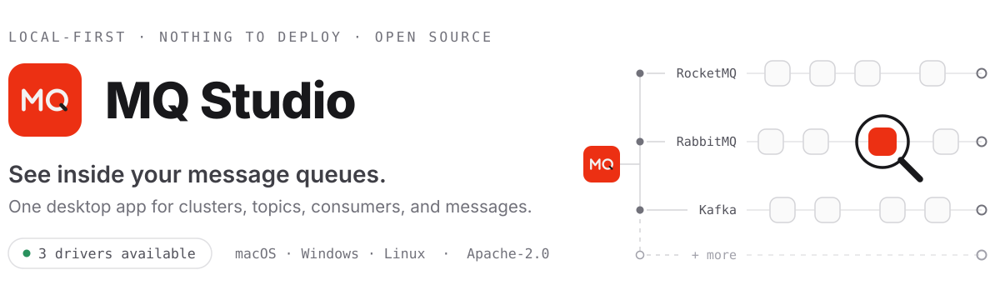
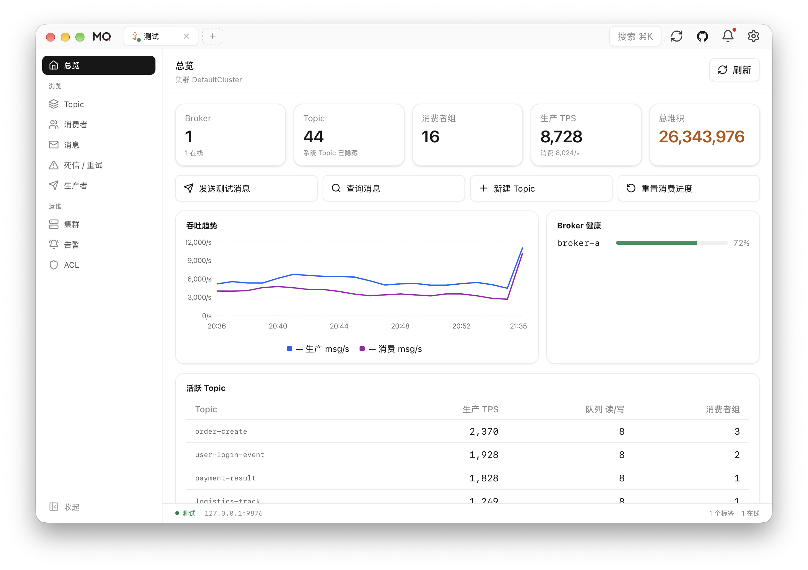
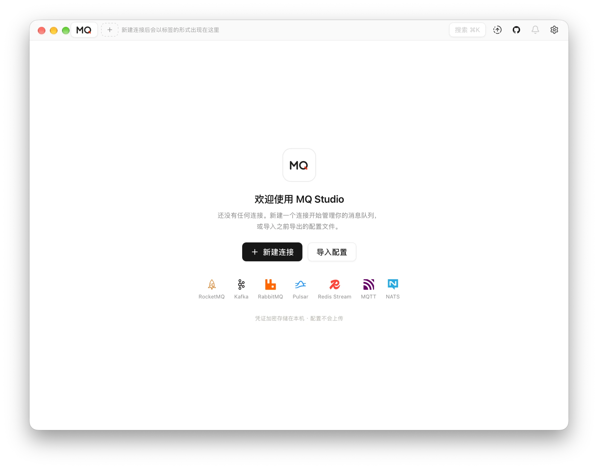
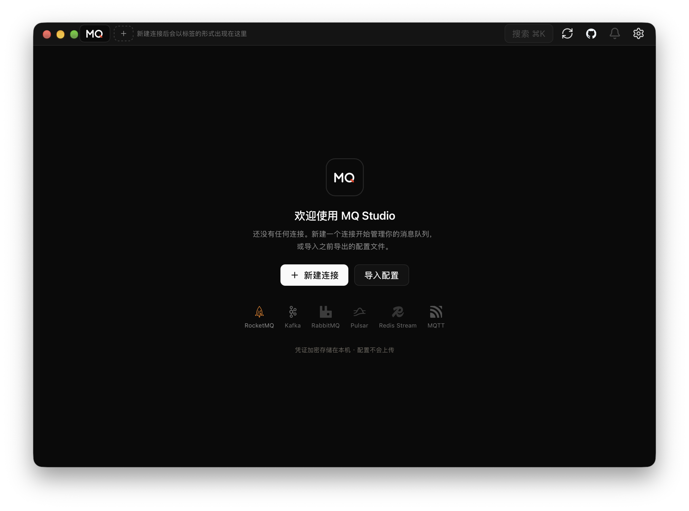
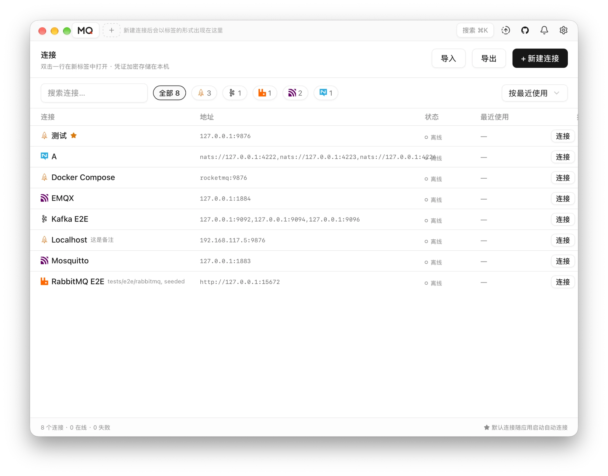
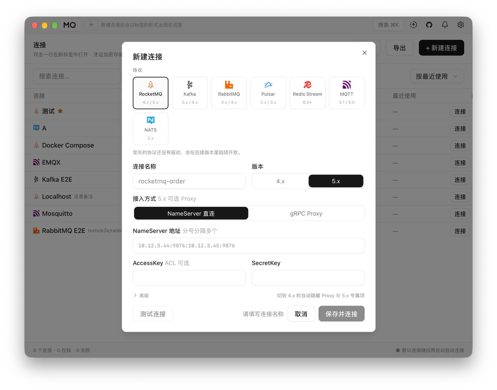
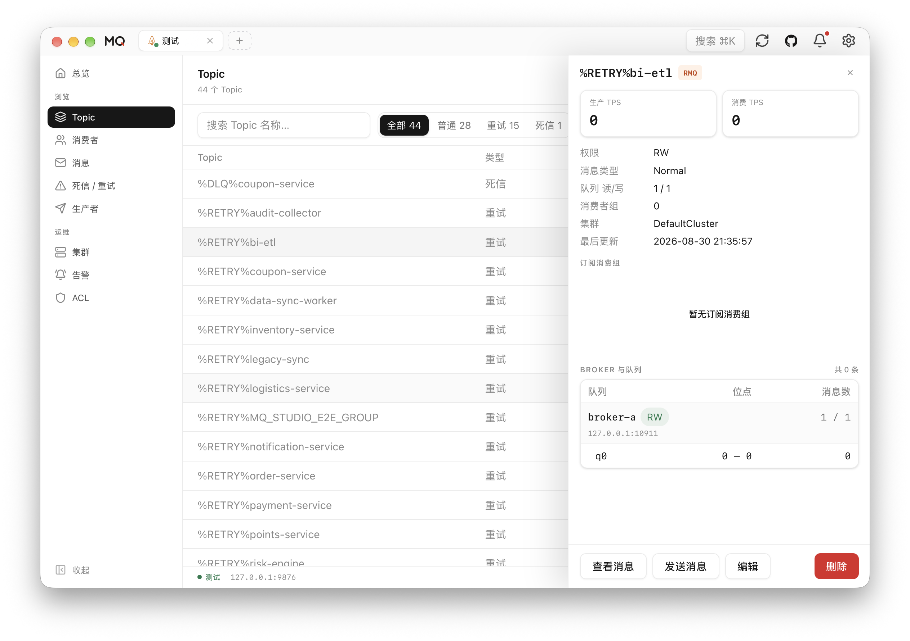
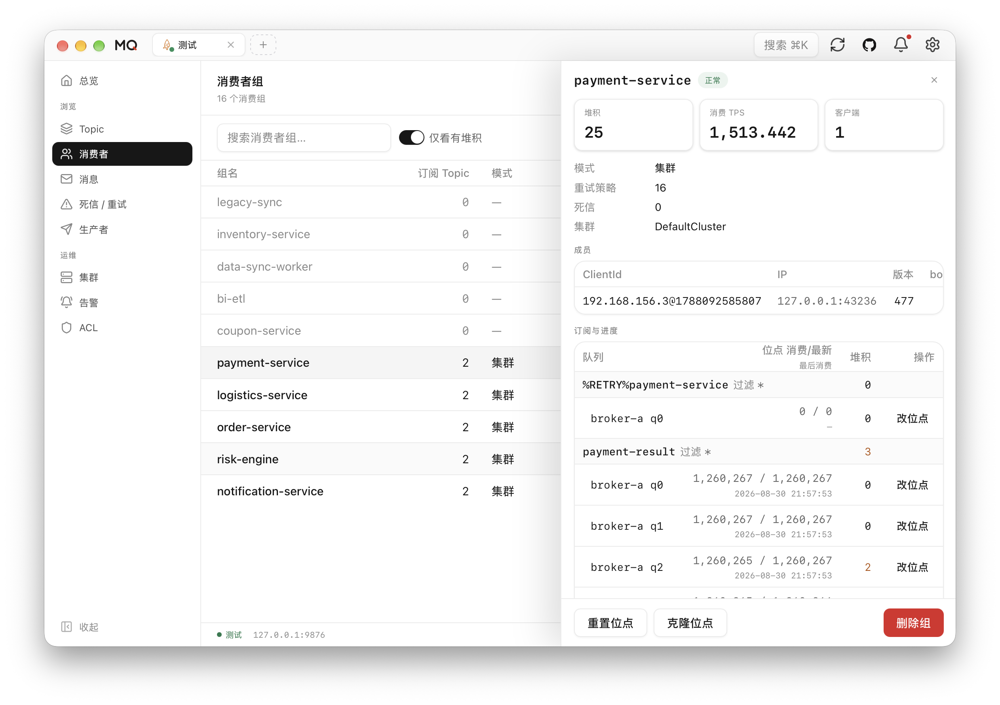
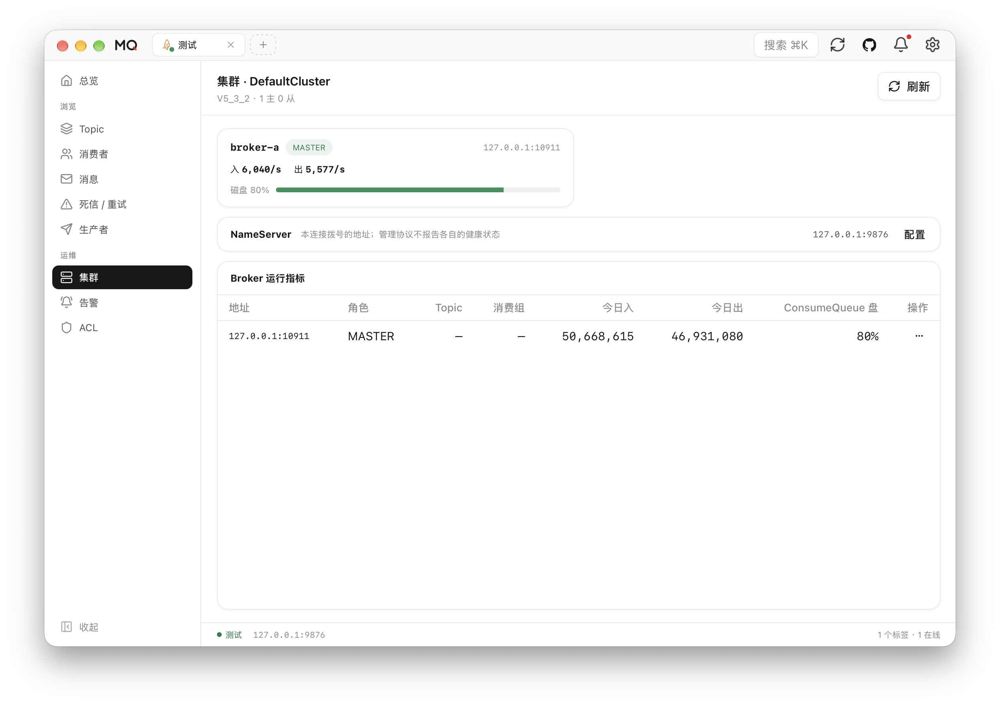
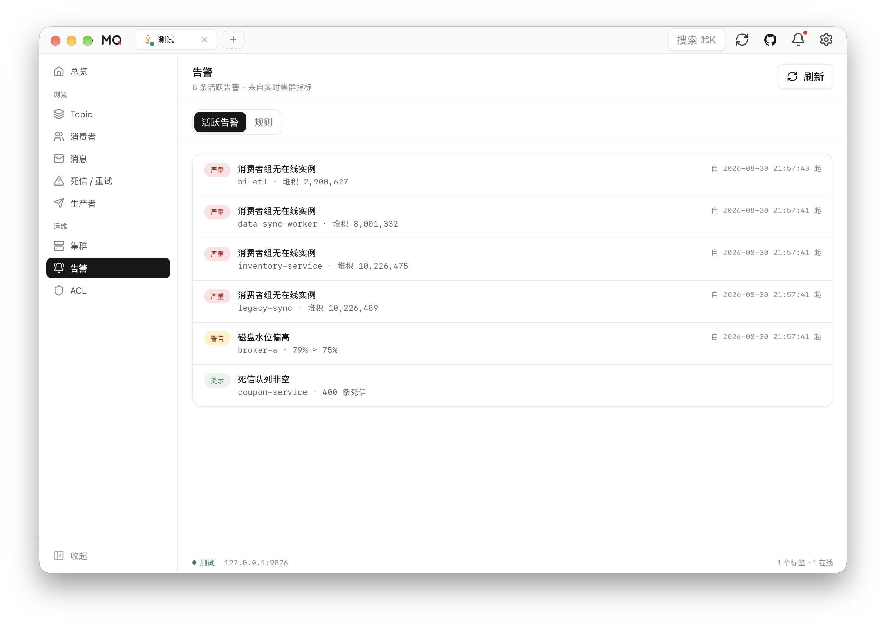

<div align="center">
  <picture>
    <source media="(prefers-color-scheme: dark)" srcset="docs/images/hero-dark.svg">
    
  </picture>
</div>

<p align="center">
  <a href="https://github.com/amigoer/mq-studio/releases/latest"></a>
  <a href="https://github.com/amigoer/mq-studio/releases"></a>
  <a href="LICENSE"></a>
</p>

<p align="center">
  <a href="README.zh-CN.md">简体中文</a>&nbsp;&nbsp;·&nbsp;&nbsp;
  <a href="https://github.com/amigoer/mq-studio/releases">Download</a>&nbsp;&nbsp;·&nbsp;&nbsp;
  <a href="docs/INSTALL.md">Install guide</a>&nbsp;&nbsp;·&nbsp;&nbsp;
  <a href="#roadmap">Roadmap</a>&nbsp;&nbsp;·&nbsp;&nbsp;
  <a href="docs/ARCHITECTURE.md">Documentation</a>
</p>

<br>

<p align="center">
  <a href="docs/images/readme/overview.png"></a>
</p>
<p align="center">
  <sub>Cluster health, live throughput, consumer lag, and broker status — one glance after connecting.</sub>
</p>

## Why MQ Studio

Every message queue arrives with a console of its own — RocketMQ has one, Kafka has another,
RabbitMQ ships a management plugin. Different interfaces, different vocabulary, and every one
of them a service to deploy and keep alive.

MQ Studio is one client for all of them. Each broker is reached through a driver sitting
behind the same interface, so the pages and the workflow stay the same whichever system you
are connected to. Install the app, add a connection, and start working: there is no server
component to deploy, secure, or keep alive.

- **One interface, every broker** — drivers land one at a time, each taken to the same depth
- **Honest about what it connects to** — every connection reports what its endpoint can actually do, and the pages are drawn from that
- **Ready to use** — download, connect, work; no web console to stand up and maintain
- **Private by default** — configuration stays on your device and credentials are encrypted at rest
- **Cross-platform** — macOS, Windows, and Linux, with English and Chinese interfaces

RocketMQ, RabbitMQ, and Kafka are the drivers available today; [Driver support](#driver-support) has the rest.

## Features

| Area | What you can do |
| --- | --- |
| **Connections** | Manage multiple clusters with free-text groups, NameServers, auto-connect, and ACL credentials |
| **Topics & Messages** | Create and inspect topics; query, trace, resend, and produce messages; smart search with fuzzy matching and recently-used lists for Topic and consumer group selectors |
| **Consumers** | View groups, clients, subscriptions, and lag; reset offsets; handle retry and DLQ |
| **Cluster & Alerts** | Monitor brokers, runtime metrics, throughput, lag, disk usage, and desktop alerts |
| **Administration** | Manage consumer settings, Topic settings, ACL, and global whitelist |
| **Personalization** | Switch theme and language, customize display, import or export configuration, and automatic update checks |

## Product tour

Select any screenshot to open it at full resolution.

<table>
  <tr>
    <td width="50%" align="center">
      <a href="docs/images/readme/welcome-light.png"></a>
      <sub><strong>First launch</strong> — no connection yet: create one, or import a previous export.</sub>
    </td>
    <td width="50%" align="center">
      <a href="docs/images/readme/welcome-dark.png"></a>
      <sub><strong>Dark theme</strong> — the whole interface follows the system theme, or the one you pick.</sub>
    </td>
  </tr>
  <tr>
    <td width="50%" align="center">
      <a href="docs/images/readme/connections.png"></a>
      <sub><strong>Connections</strong> — every cluster in one list; double-click a row to open it in its own tab.</sub>
    </td>
    <td width="50%" align="center">
      <a href="docs/images/readme/new-connection.png"></a>
      <sub><strong>Adding a connection</strong> — pick the protocol and version, then NameServer or gRPC Proxy, with optional ACL keys.</sub>
    </td>
  </tr>
  <tr>
    <td width="50%" align="center">
      <a href="docs/images/readme/topics.png"></a>
      <sub><strong>Topic operations</strong> — filter by type, then inspect queues, routing, and subscriptions in the detail panel.</sub>
    </td>
    <td width="50%" align="center">
      <a href="docs/images/readme/consumers.png"></a>
      <sub><strong>Consumer diagnostics</strong> — lag, consume TPS, and clients per group; reset or clone offsets queue by queue.</sub>
    </td>
  </tr>
  <tr>
    <td width="50%" align="center">
      <a href="docs/images/readme/cluster.png"></a>
      <sub><strong>Cluster monitoring</strong> — broker roles, throughput, disk water level, and messages in and out today.</sub>
    </td>
    <td width="50%" align="center">
      <a href="docs/images/readme/alerts.png"></a>
      <sub><strong>Alerts</strong> — active alerts derived from live cluster metrics, with the rules behind them.</sub>
    </td>
  </tr>
</table>

## Driver support

MQ Studio reaches every broker through a pluggable driver. Each driver declares its own
capabilities, so the interface only offers what the connected broker can actually do.

| Driver | Status | Notes |
| --- | --- | --- |
| **RocketMQ** 4.x / 5.x | ✅ Available | Full feature set through Admin APIs |
| **RabbitMQ** 3.x / 4.x | ✅ Available | Full management plane: queues, exchanges and bindings, connections and channels, browse and publish over AMQP, dead letters, virtual hosts, users and permissions, policies, definitions, shovels and federation |
| **Kafka** 3.x / 4.x | ✅ Available | Topics with their partitions, replicas and settings; consumer groups with per-partition lag and every offset reset Kafka offers; browsing and following a log; producing with keys, headers and an acknowledgement level; brokers, their effective settings and their log directories; ACLs and SCRAM users; client quotas; partition reassignment and preferred-leader election; and the cluster's open transactions |
| Pulsar · NATS · MQTT · SQS and more | 📋 Planned | Full matrix below |

<details>
<summary><strong>Planned drivers, wire-compatible systems, and scope</strong></summary>
<br>

| Driver | Status | Notes |
| --- | --- | --- |
| **Pulsar** | 📋 Planned | |
| **ActiveMQ / Artemis** | 📋 Planned | JMS queues and topics over the Jolokia management API |
| **Redis Stream** | 📋 Planned | Streams and consumer groups; no cluster plane |
| **NATS** | 📋 Planned | JetStream streams and consumers; NATS core is publish/subscribe only |
| **NSQ** | 📋 Planned | Topics and channels over the nsqd HTTP API |
| **MQTT** | 📋 Planned | Publish and subscribe only — the protocol has no admin plane |
| **Amazon SQS** | 📋 Planned | Queues, attributes, and dead-letter redrive |
| **Google Cloud Pub/Sub** | 📋 Planned | Topics and subscriptions with backlog |
| **Azure Service Bus** | 📋 Planned | Queues, topics, subscriptions, rules, dead-letter queues |
| **Amazon Kinesis** | 📋 Planned | Streams and shards |
| **IBM MQ** | 📋 Planned | Queues and channels over the administrative REST API |
| **Solace PubSub+** | 📋 Planned | Queues and topic endpoints over SEMP |

**Covered by an existing driver.** Wire-compatible systems do not get a driver of their own:
Redpanda, AutoMQ, WarpStream, Confluent, Amazon MSK, and Azure Event Hubs connect as Kafka;
EMQX, Mosquitto, HiveMQ, and VerneMQ as MQTT; Amazon MQ as ActiveMQ or RabbitMQ; Alibaba Cloud
and Tencent Cloud RocketMQ as RocketMQ. Each driver declares what its family can do and the
pages are drawn from that; probing an endpoint to narrow it per deployment is not built yet.

**Out of scope.** ZeroMQ and nanomsg have no broker and therefore no management plane. Celery,
Sidekiq, and BullMQ are application-level job queues layered on Redis or RabbitMQ rather than
message brokers.

</details>

ACL and some advanced operations depend on the broker version and configuration. The capability
model behind this table is described in [the multi-MQ design](docs/MULTI_MQ_DESIGN.md).

## Roadmap

Drivers land one at a time. Each one is taken to the depth RocketMQ already has — topics,
consumers, messages, cluster, and alerts — before the next one starts, so no driver ships as a
half-wired set of pages.

| Phase | Scope | Status |
| --- | --- | --- |
| 1 | RocketMQ 4.x / 5.x | ✅ Done |
| 2 | RabbitMQ | ✅ Done |
| 3 | Kafka | ✅ Done |
| 4 | The remaining drivers, in the order listed under Driver support | 📋 Next |
| 5 | Agent features | 📋 Planned |

Agent work starts once driver coverage is in place, not before. Every driver already declares
what the connected broker can actually do, and that capability model is the foundation an agent
needs to work across brokers without offering operations the broker cannot perform. The scope
will be published here once phase 4 lands.

This is a sequence, not a schedule: no dates are attached to it, and the order after Kafka can
change if there is enough demand for a driver further down the list.

## Download

Grab the latest package from **[GitHub Releases](https://github.com/amigoer/mq-studio/releases)**.
Packages are named `mq-studio-<version>-<os>-<arch>.<ext>`, where `os` is `mac`, `windows`, or
`linux` and `arch` is `amd64` or `arm64`.

| Platform | Package | Requires |
| --- | --- | --- |
| macOS Apple Silicon / Intel | `-mac-arm64.dmg` / `-mac-amd64.dmg` | macOS 12+ |
| Windows x64 / ARM64 | `-windows-amd64.exe` / `-windows-arm64.exe` | Windows 10+ |
| Debian / Ubuntu | `-linux-amd64.deb` / `-linux-arm64.deb` | GTK 4, WebKitGTK 6.0 |
| Fedora / RHEL | `-linux-amd64.rpm` / `-linux-arm64.rpm` | GTK 4, WebKitGTK 6.0 |
| Any Linux | `-linux-amd64.AppImage` / `-linux-arm64.AppImage` | GTK 4, WebKitGTK 6.0 |

The Linux packages are built against the GTK 4 stack, which means Ubuntu 24.04 or later,
Debian 13 or later, and equivalent releases elsewhere. Earlier distributions ship
WebKit2GTK 4.1 and cannot run these packages.

On a Mac, About This Mac tells you whether to take `arm64` or `amd64`.

macOS builds are not signed by a registered Apple developer yet, so the first launch needs one
extra step — the disk image ships a helper for it. See **[INSTALL](docs/INSTALL.md)** for that
and for the per-platform install steps. Every release ships a `SHA256SUMS.txt` you can verify
downloads against.

## Quick start

1. Open MQ Studio and create a connection.
2. Enter one or more NameServer addresses and optional ACL credentials.
3. Save, connect, and choose a feature from the sidebar.

Your profiles and settings stay in the local user configuration directory. Configuration
exports contain plaintext credentials and should be stored securely.

## Development

Requires Go 1.25+, Node.js 20+, npm, and the [Wails 3 CLI](https://v3.wails.io).

```bash
go install github.com/wailsapp/wails/v3/cmd/wails3@latest
make install
make dev
```

Use `make check` to run project checks, `make package` to build a distributable, and
`make help` to list all commands.

## Docs

[Architecture](docs/ARCHITECTURE.md) · [Install](docs/INSTALL.md) · [Changelog](CHANGELOG.md) · [Releasing](RELEASE.md) · [Roadmap](docs/ROADMAP.md)

## Community

Questions, requests, or thoughts on which driver should come next:
[GitHub Issues](https://github.com/amigoer/mq-studio/issues) · [linux.do](https://linux.do) (in Chinese)

## License

[Apache-2.0](LICENSE) © 2026 [amigoer](https://github.com/amigoer)
