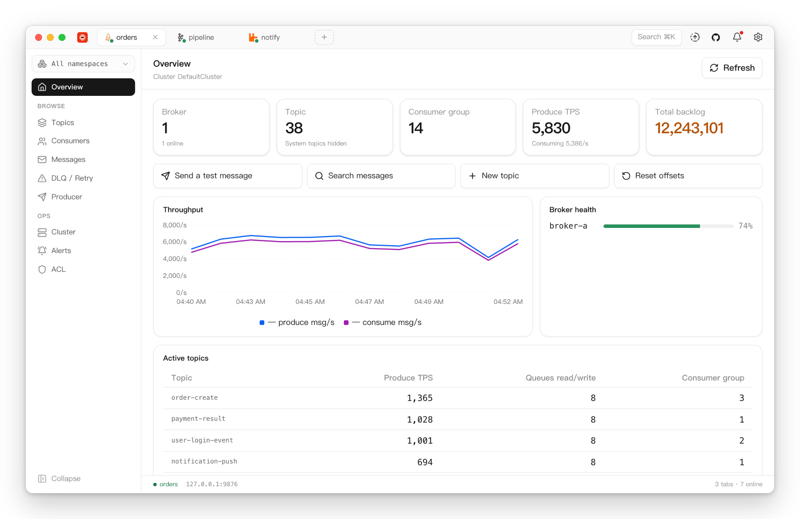
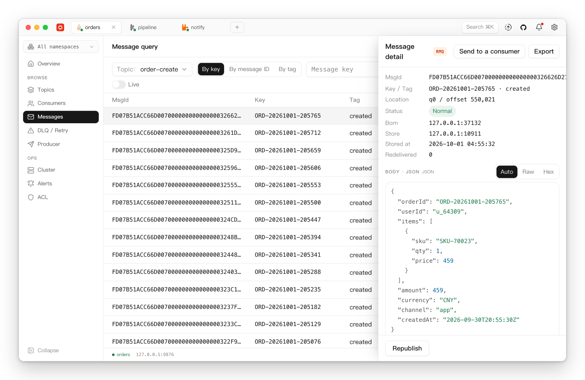
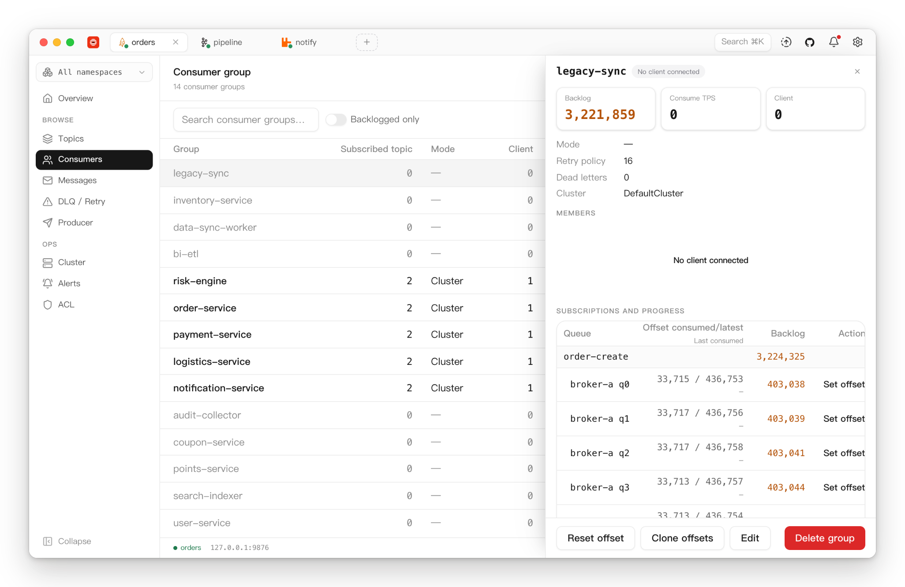
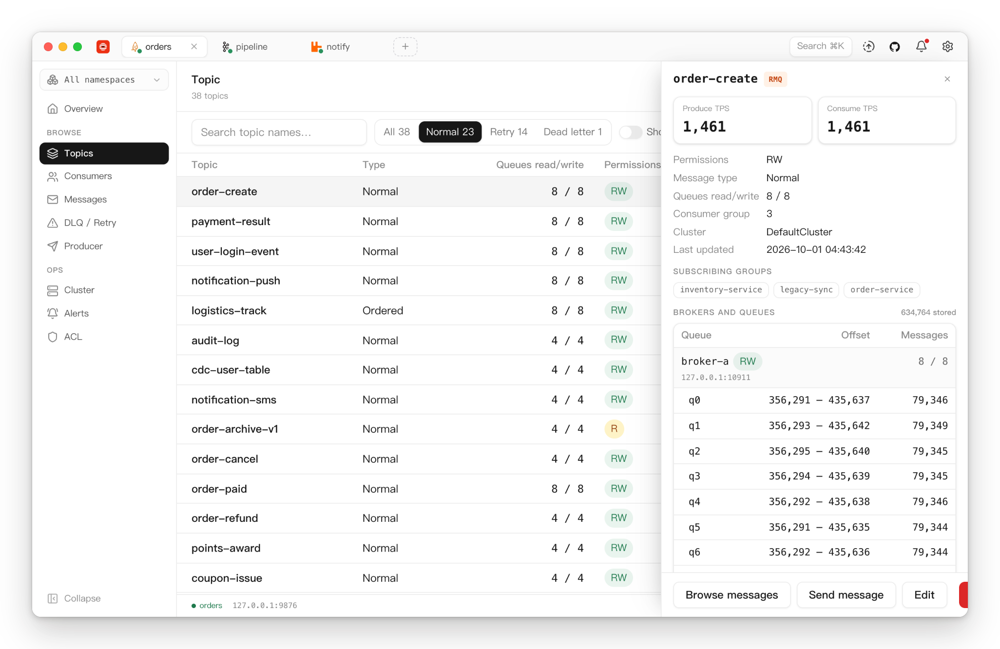
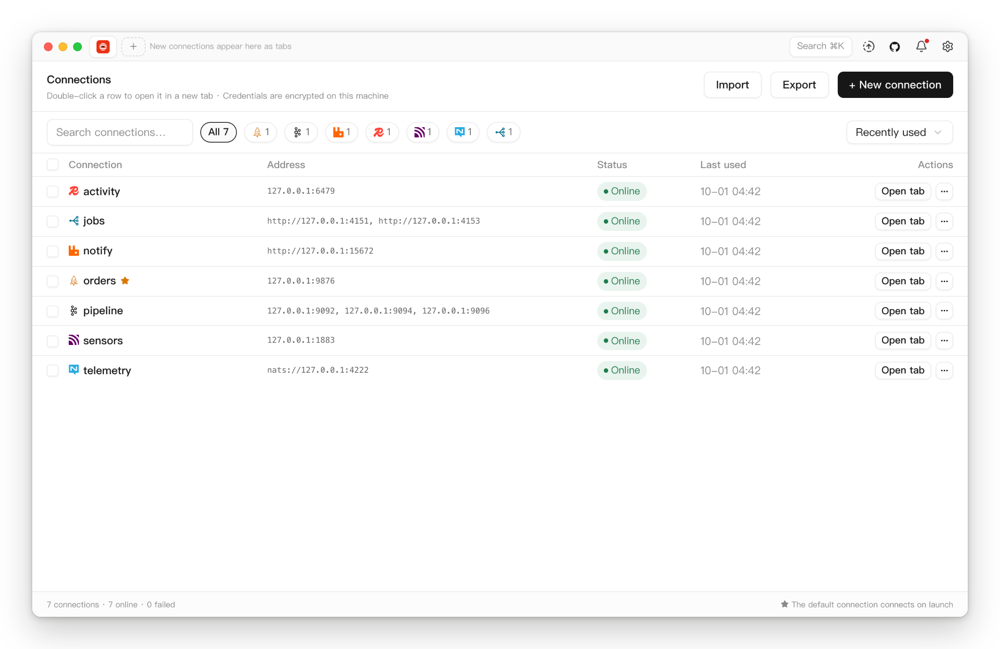

<div align="center">
  <picture>
    <source media="(prefers-color-scheme: dark)" srcset="docs/images/hero-dark.svg">
    
  </picture>

  <h3>One interface for every message queue</h3>

  <p>Look inside RocketMQ, Kafka, RabbitMQ, Pulsar, Redis Stream, NATS and more:<br>topics, consumers, messages and cluster health in one local-first desktop app, with nothing to deploy.</p>

  <p>
    <a href="https://github.com/amigoer/mq-studio/releases/latest"></a>
    <a href="https://github.com/amigoer/mq-studio/releases"></a>
    <a href="https://app.codecov.io/gh/amigoer/mq-studio"></a>
    <a href="LICENSE"></a>
  </p>

  <p>
    <a href="https://mq-studio.amigoer.com/en/"><strong>Download</strong></a>&nbsp;&nbsp;·&nbsp;&nbsp;
    <a href="docs/INSTALL.md">Install guide</a>&nbsp;&nbsp;·&nbsp;&nbsp;
    <a href="docs/DRIVERS.md">Brokers</a>&nbsp;&nbsp;·&nbsp;&nbsp;
    <a href="docs/MCP.md">For agents</a>&nbsp;&nbsp;·&nbsp;&nbsp;
    <a href="README.zh-CN.md">简体中文</a>
  </p>
</div>

<br>

<picture>
  <source media="(prefers-color-scheme: dark)" srcset="docs/images/readme/overview.en.dark.png">
  
</picture>

## Why MQ Studio

Every broker comes with a console of its own: different pages, different words, and one more
service to deploy and keep alive. MQ Studio puts all of them behind the same pages.

- **Nothing to deploy.** A desktop app for macOS, Windows and Linux. Profiles stay on your
  machine, and credentials are encrypted at rest.
- **One workflow for every broker.** Topics, consumers, messages, cluster and alerts work the
  same way whichever broker you connect to.
- **Honest about each broker.** Every connection reports what its endpoint can actually do, so
  a feature the broker lacks is explained rather than faked.
- **Open to agents.** The same binary serves your connections over MCP: read-only by default,
  destructive steps confirmed by a person, every write recorded.

## A closer look

<table>
  <tr>
    <td width="50%" valign="top">
      
      <p><strong>Messages.</strong> Query by key, tag or id, open the body, and see which consumer groups have read it.</p>
    </td>
    <td width="50%" valign="top">
      
      <p><strong>Consumer lag.</strong> See why a group is behind: backlog per queue, who is connected, and offsets to reset or clone.</p>
    </td>
  </tr>
  <tr>
    <td width="50%" valign="top">
      
      <p><strong>Topics.</strong> Throughput, queues and subscribers for every topic, read from the broker itself.</p>
    </td>
    <td width="50%" valign="top">
      
      <p><strong>Connections.</strong> Every cluster in one list, whatever the broker; each opens in its own tab.</p>
    </td>
  </tr>
</table>

## Supported brokers

| Broker | Versions | Good to know |
| --- | --- | --- |
| RocketMQ | 4.x / 5.x | NameServer address; trace, offset reset and clone, ACL |
| Kafka | 3.x / 4.x | Offset resets, ACLs, SCRAM users, quotas, reassignment |
| RabbitMQ | 3.x / 4.x | Management API plus AMQP; browsing requeues what it reads |
| Pulsar | 3.x / 4.x | Tenants and namespaces, cursor moves, role grants |
| Redis Stream | 6.0+ | Pending entries, claim and ack; sentinel and cluster |
| MQTT | 3.1.1 / 5.0 | Live subscribe; sessions through EMQX-style management APIs |
| NATS | 2.x | JetStream streams and consumers, a core subjects workbench |
| ActiveMQ | Classic 5.x / 6.x<br>Artemis 2.x | Both products, told apart on connect; browsing takes nothing |
| NSQ | 1.x | Topics and channels across every nsqd; no browse, no DLQ |
| Amazon SQS | managed | Standard and FIFO; browsing goes through ReceiveMessage |
| Google Pub/Sub | managed | Subscriptions, snapshots and seek; no backlog figure |
| Azure Service Bus | managed | Queues, topics and subscription rules; browsing is a peek |
| Amazon Kinesis | managed | Shards and their lineage; no backlog, browsing uses quota |
| IBM MQ | 9.1+ | Queues, topics and channels over mqweb REST; text bodies only |
| Solace PubSub+ | 10.x | Message VPNs and subscriptions over SEMP v2; no payloads |

[docs/DRIVERS.md](docs/DRIVERS.md) describes what each driver covers, the wire-compatible
systems that connect through an existing one, and how to ask for another.

## Download

Get the build for your system at **[mq-studio.amigoer.com](https://mq-studio.amigoer.com/en/)**,
or from [GitHub Releases](https://github.com/amigoer/mq-studio/releases), which also carries
`SHA256SUMS.txt` and every earlier version.

| System | Packages | Requires |
| --- | --- | --- |
| macOS | `.dmg` for Apple silicon and Intel | macOS 12+ |
| Windows | `.exe` for x64 and ARM64 | Windows 10+ |
| Linux | `.deb`, `.rpm` and `.AppImage` for x64 and ARM64 | GTK 4 and WebKitGTK 6.0: Ubuntu 24.04+, Debian 13+ |

macOS builds are not signed by a registered Apple developer yet, so the first launch needs one
extra step. [The install guide](docs/INSTALL.md) covers it, and every platform's install steps.

## Use it from an agent

The same binary is an [MCP](https://modelcontextprotocol.io) server, so an agent can work the
connections you have already saved:

```bash
claude mcp add mq-studio -- "/Applications/MQ Studio.app/Contents/MacOS/mq-studio" mcp
```

It is read-only unless you allow more when you start it:

- `--allow mutate` adds creating, publishing and moving offsets; `--allow destructive` adds
  emptying and deleting.
- `--allow scratch=destructive` raises one connection alone, by the name the window shows.
- Emptying and deleting ask a person through the client first, and every write is logged to
  `agent-audit.jsonl`.

[docs/MCP.md](docs/MCP.md) has the details, the setup for other clients, and every tool.

## Build from source

Requires Go (the version `go.mod` pins), Node.js 20.19+ or 22.12+, npm, and the
[Wails 3 CLI](https://v3.wails.io).

```bash
go install github.com/wailsapp/wails/v3/cmd/wails3@latest
make install
make dev
```

`make check` runs what CI runs. [CONTRIBUTING.md](CONTRIBUTING.md) covers the live tests and
how a driver is added.

## More

[Architecture](docs/ARCHITECTURE.md) · [Roadmap](docs/ROADMAP.md) · [Changelog](CHANGELOG.md) ·
[Releasing](RELEASE.md) · Questions and requests go to
[GitHub Issues](https://github.com/amigoer/mq-studio/issues) or
[linux.do](https://linux.do) (in Chinese).

[Apache-2.0](LICENSE) © 2026 [amigoer](https://github.com/amigoer)
