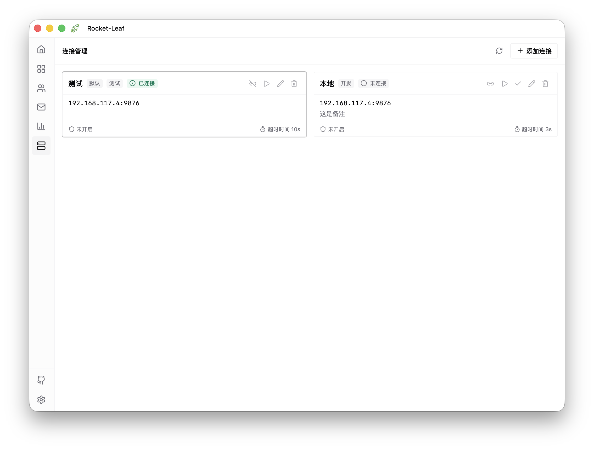
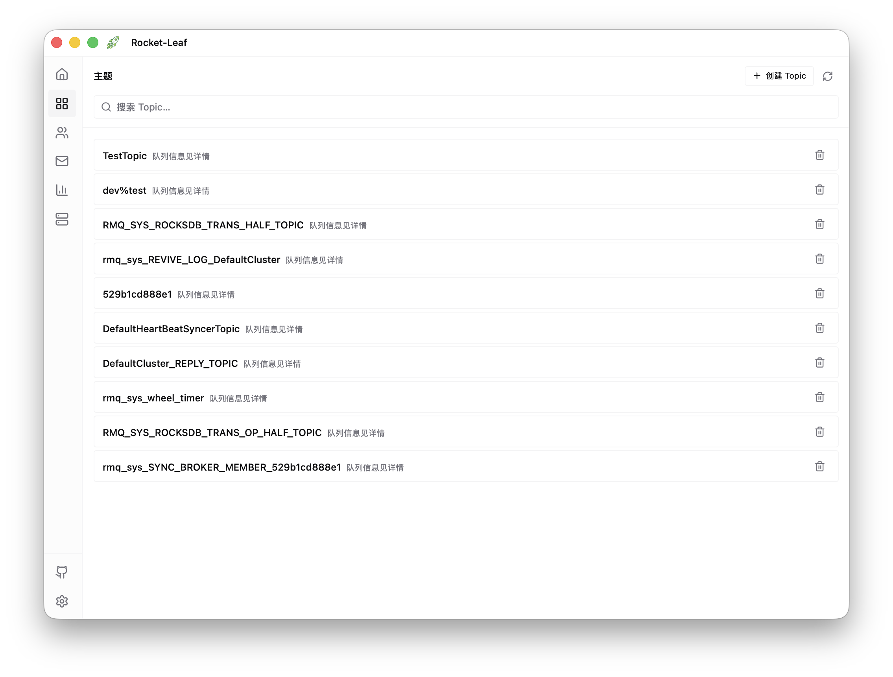
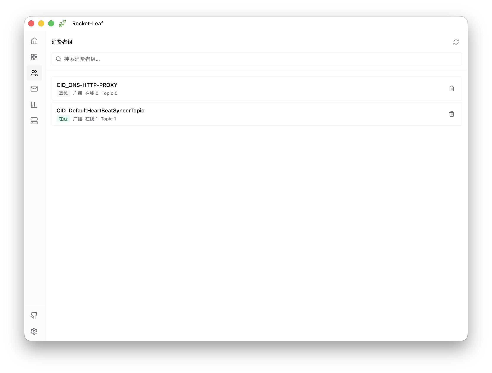
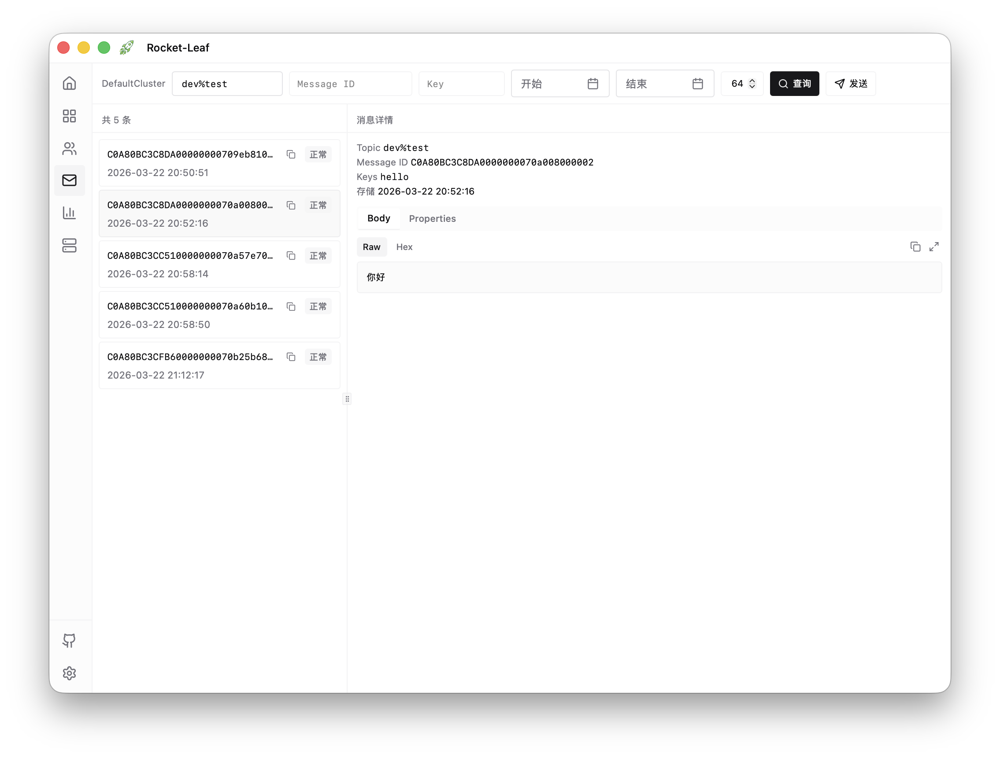
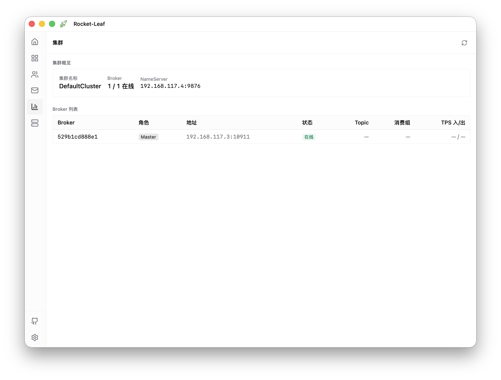
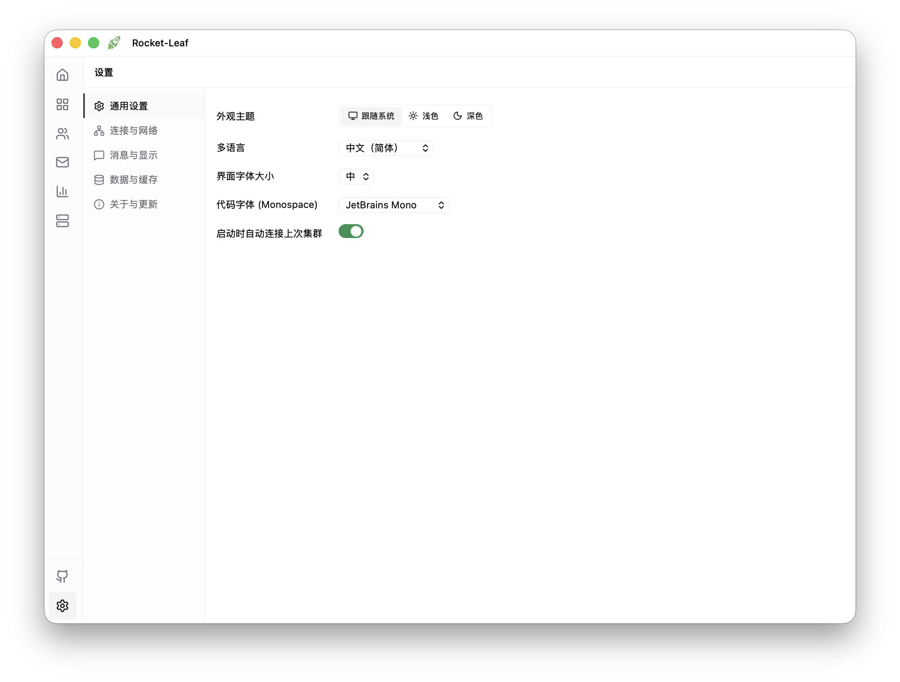

# Rocket-Leaf

<p align="center">
  
</p>

<p align="center">
  <strong>轻量、美观的 RocketMQ 桌面客户端</strong>
</p>

<p align="center">
  Windows · macOS · Linux
</p>

<p align="center">
  <a href="README.md">English</a>
</p>

## 这是什么？

Rocket-Leaf 是一个**本地桌面应用**，用来连接和管理 RocketMQ 集群。你可以查看 Topic、消费者组、消息详情和集群状态，也可以发送测试消息，而不需要额外部署 Web 控制台或暴露管理端口。

- **开箱即用**：下载后即可直接运行
- **跨平台**：支持 Windows、macOS、Linux
- **数据保存在本地**：连接配置与设置保存在当前设备，便于备份和迁移

## 功能概览

| 能力         | 说明                                                                    |
| ------------ | ----------------------------------------------------------------------- |
| **概览**     | 集群快照、生产/消费 TPS、堆积汇总与快捷入口                             |
| **连接管理** | 多集群、默认连接、ACL 凭证、本地持久化与敏感字段加密                    |
| **Topic**    | 列表、搜索、路由/统计、创建/更新/删除                                   |
| **消费者组** | 列表、消费进度、客户端、重置位点、组配置增删改                          |
| **消息**     | 按 Topic / Key / Tag / MessageId / 时间查询，轨迹、重发、DLQ 与重试队列 |
| **生产者**   | 发送测试消息（Tag、Key、Body、延时级别）                                |
| **集群**     | Broker、NameServer、运行时指标与吞吐趋势                                |
| **告警**     | 基于实时数据与阈值的客户端规则（如堆积、磁盘）                          |
| **ACL**      | AccessConfig 与全局白名单（需 Broker 支持相关管理接口）                 |
| **设置**     | 主题、语言（中/英）、超时、展示选项、配置导入导出                       |

## 界面预览

|                                                     |                                                  |
| --------------------------------------------------- | ------------------------------------------------ |
|  |       |
| 连接管理                                            | Topic                                            |
|    |  |
| 消费者组                                            | 消息查询                                         |
|          |      |
| 集群                                                | 设置                                             |

## 技术栈

| 层级   | 技术                                                                   |
| ------ | ---------------------------------------------------------------------- |
| 桌面壳 | [Wails v3](https://wails.io/)                                          |
| 后端   | Go + [rocketmq-admin-go](https://github.com/amigoer/rocketmq-admin-go) |
| 前端   | React 18、TypeScript、Vite、Tailwind CSS                               |
| 存储   | 用户配置目录下的本地 JSON（敏感字段 AES-256-GCM）                      |

详情：[架构说明](docs/ARCHITECTURE.md) · [路线图](docs/ROADMAP.md)

## 下载与安装

从 [Releases](https://github.com/amigoer/rocket-leaf/releases) **按自己的系统只下一个文件**：

| 平台                              | 下载文件                                  |
| --------------------------------- | ----------------------------------------- |
| **macOS Apple Silicon（M 系列）** | `rocket-leaf-macos-arm64.app.zip`         |
| **macOS Intel**                   | `rocket-leaf-macos-amd64.app.zip`         |
| **Windows x64**                   | `rocket-leaf-windows-amd64-installer.exe` |
| **Windows ARM64**                 | `rocket-leaf-windows-arm64-installer.exe` |
| **Linux x64**                     | `rocket-leaf-linux-amd64.AppImage`        |
| **Linux ARM64**                   | `rocket-leaf-linux-arm64.AppImage`        |

- **macOS**：解压后拖到「应用程序」；若被拦截，可右键 → 打开。
- **Windows**：运行安装包即可。
- **Linux**：`chmod +x rocket-leaf-linux-*.AppImage && ./rocket-leaf-linux-*.AppImage`

## 快速开始

1. 打开应用，进入 **连接管理**（或从概览添加连接）。
2. 填写集群信息：`NameServer` 为必填；若集群开启 ACL，再填写 AccessKey / SecretKey。
3. 保存并 **连接**。之后可在侧边栏使用 Topic、消费者组、消息、生产者、集群、ACL 等功能。

连接配置与设置会保存在本机。

<details>
<summary>本地数据存储位置</summary>

位于系统用户配置目录下的 `rocket-leaf/`：

| 文件               | 用途             |
| ------------------ | ---------------- |
| `connections.json` | 连接配置         |
| `settings.json`    | 应用设置         |
| `secret.key`       | 敏感字段加密密钥 |

常见路径：

- **macOS**: `~/Library/Application Support/rocket-leaf/`
- **Linux**: `~/.config/rocket-leaf/`
- **Windows**: `%AppData%\rocket-leaf\`

</details>

## 开发

依赖：Go（见 `go.mod`）、Node.js 20+、[Task](https://taskfile.dev/)、Wails v3 CLI。

```bash
npm install
npm --prefix frontend install

# 桌面开发（Wails + Vite）
task dev

# 当前平台构建 / 打包
task build
task package

# 格式化与类型检查
npm run check
```

可选本地辅助脚本（需可访问的 NameServer）：

```bash
go run ./scripts/seed-data [nameServer] [duration_sec] [rate_per_sec]
go run ./scripts/inspect-cluster ...
```

## 路线图与参与开发

- 功能状态与后续规划：[路线图](docs/ROADMAP.md)
- 技术栈与目录结构：[架构说明](docs/ARCHITECTURE.md)
- 欢迎提交 Issue 和 PR

## 许可证

[MIT](LICENSE) · [amigoer/rocket-leaf](https://github.com/amigoer/rocket-leaf)
