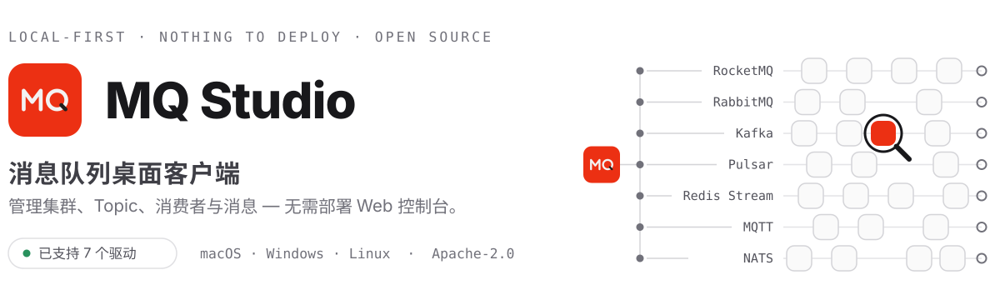

<div align="center">
  <picture>
    <source media="(prefers-color-scheme: dark)" srcset="docs/images/hero-dark.zh-CN.svg">
    
  </picture>
</div>

<p align="center">
  <a href="https://github.com/amigoer/mq-studio/releases/latest"></a>
  <a href="https://github.com/amigoer/mq-studio/releases"></a>
  <a href="LICENSE"></a>
</p>

<p align="center">
  <a href="README.md">English</a>&nbsp;&nbsp;·&nbsp;&nbsp;
  <a href="https://github.com/amigoer/mq-studio/releases">下载</a>&nbsp;&nbsp;·&nbsp;&nbsp;
  <a href="docs/INSTALL.zh-CN.md">安装说明</a>&nbsp;&nbsp;·&nbsp;&nbsp;
  <a href="docs/ARCHITECTURE.md">文档</a>
</p>

<br>

<p align="center">
  <a href="docs/images/overview.png"></a>
</p>
<p align="center">
  <sub>连接之后，集群健康、实时吞吐、消费堆积与 Broker 状态一眼可见。</sub>
</p>

## 为什么用 MQ Studio

MQ Studio 把消息队列运维当作一个桌面问题来解决：安装应用、添加连接，然后开始工作。
没有需要部署、加固和值守的服务端组件。

- **安装即用** — 下载、连接、开工，不需要搭建和维护 Web 控制台
- **专注日常运维** — 一个应用覆盖运营消息队列的日常操作
- **数据留在本机** — 配置保存在当前设备，凭证加密存储
- **跨平台与双语** — 支持 macOS、Windows、Linux，提供中英文界面

## 功能

| 模块 | 能力 |
| --- | --- |
| **连接** | 管理多个集群，支持自由文本分组、NameServer、自动连接与 ACL 凭证 |
| **Topic 与消息** | 创建和查看 Topic；查询、追踪、重发与生产消息；Topic 与消费组选择器支持智能模糊搜索与最近使用记忆 |
| **消费者** | 查看消费组、客户端、订阅与堆积；重置位点；处理重试与死信消息 |
| **集群与告警** | 监控 Broker、运行指标、吞吐、堆积、磁盘状态与桌面告警 |
| **管理能力** | 管理消费者配置、Topic 配置、ACL 与全局白名单 |
| **个性化** | 切换主题与语言、自定义显示、导入或导出配置、自动检查更新 |

## 产品一览

点击任意截图可查看完整尺寸原图。

<table>
  <tr>
    <td width="50%" align="center">
      <a href="docs/images/topics.png"></a>
      <sub><strong>Topic 操作</strong> — 查看队列、路由与订阅关系。</sub>
    </td>
    <td width="50%" align="center">
      <a href="docs/images/consumers.png"></a>
      <sub><strong>消费诊断</strong> — 跟踪客户端、订阅、TPS 与消息堆积。</sub>
    </td>
  </tr>
  <tr>
    <td width="50%" align="center">
      <a href="docs/images/messages.png"></a>
      <sub><strong>消息检查</strong> — 查询消息并查看消息体、属性与轨迹。</sub>
    </td>
    <td width="50%" align="center">
      <a href="docs/images/cluster.png"></a>
      <sub><strong>集群监控</strong> — 查看健康状态、吞吐、Broker 与磁盘使用率。</sub>
    </td>
  </tr>
</table>

## 驱动支持

MQ Studio 通过可插拔驱动对接各类消息中间件。每个驱动声明自己的能力，界面只呈现所连
中间件真正支持的功能。

| 驱动 | 状态 | 说明 |
| --- | --- | --- |
| **RocketMQ** 4.x / 5.x | ✅ 已发布 | 通过 Admin API 提供完整功能 |
| **RabbitMQ** | 🚧 开发中 | 队列、消费者、消息浏览与发布、集群拓扑、Exchange 与 Binding |
| Kafka · Pulsar · NATS · MQTT · SQS 等 | 📋 计划中 | 完整矩阵见下方折叠内容 |

<details>
<summary><strong>计划中的驱动、协议兼容系统与范围边界</strong></summary>
<br>

| 驱动 | 状态 | 说明 |
| --- | --- | --- |
| **Kafka** | 📋 计划中 | |
| **Pulsar** | 📋 计划中 | |
| **ActiveMQ / Artemis** | 📋 计划中 | 通过 Jolokia 管理接口访问 JMS 队列与主题 |
| **Redis Stream** | 📋 计划中 | Stream 与消费组；没有集群管理面 |
| **NATS** | 📋 计划中 | JetStream 的 Stream 与 Consumer；NATS Core 仅支持发布与订阅 |
| **NSQ** | 📋 计划中 | 通过 nsqd HTTP 接口访问 Topic 与 Channel |
| **MQTT** | 📋 计划中 | 仅发布与订阅 — 该协议本身没有管理面 |
| **Amazon SQS** | 📋 计划中 | 队列、属性与死信重投 |
| **Google Cloud Pub/Sub** | 📋 计划中 | Topic、Subscription 与积压量 |
| **Azure Service Bus** | 📋 计划中 | 队列、Topic、Subscription、规则与死信队列 |
| **Amazon Kinesis** | 📋 计划中 | Stream 与 Shard |
| **IBM MQ** | 📋 计划中 | 通过管理 REST 接口访问队列与通道 |
| **Solace PubSub+** | 📋 计划中 | 通过 SEMP 访问队列与主题端点 |

**由已有驱动覆盖。** 协议兼容的实现不单独占用一个驱动：Redpanda、AutoMQ、WarpStream、
Confluent、Amazon MSK 与 Azure Event Hubs 按 Kafka 连接；EMQX、Mosquitto、HiveMQ 与
VerneMQ 按 MQTT 连接；Amazon MQ 按 ActiveMQ 或 RabbitMQ 连接；阿里云与腾讯云的 RocketMQ
按 RocketMQ 连接。每个驱动在连接时探测端点，把能力收窄到该部署实际支持的范围。

**不在范围内。** ZeroMQ 与 nanomsg 没有 broker，也就没有管理面；Celery、Sidekiq 与
BullMQ 是架在 Redis 或 RabbitMQ 之上的应用层任务队列，而不是消息中间件本身。

</details>

ACL 与部分高级操作是否可用，取决于 Broker 版本和配置。表格背后的能力模型详见
[多 MQ 架构设计](docs/MULTI_MQ_DESIGN.md)。

## 下载

前往 **[GitHub Releases](https://github.com/amigoer/mq-studio/releases)** 下载最新版本。
安装包统一命名为 `mq-studio-<版本>-<系统>-<架构>.<后缀>`，系统取值 `mac`、`windows`、
`linux`，架构取值 `amd64`、`arm64`。

| 平台 | 安装包 | 系统要求 |
| --- | --- | --- |
| macOS Apple 芯片 / Intel | `-mac-arm64.dmg` / `-mac-amd64.dmg` | macOS 12+ |
| Windows x64 / ARM64 | `-windows-amd64.exe` / `-windows-arm64.exe` | Windows 10+ |
| Debian / Ubuntu | `-linux-amd64.deb` / `-linux-arm64.deb` | GTK 3、WebKit2GTK 4.1 |
| Fedora / RHEL | `-linux-amd64.rpm` / `-linux-arm64.rpm` | GTK 3、WebKit2GTK 4.1 |
| 任意 Linux | `-linux-amd64.AppImage` / `-linux-arm64.AppImage` | GTK 3、WebKit2GTK 4.1 |

Mac 上在「关于本机」里可以看到该选 `arm64` 还是 `amd64`。

macOS 版本尚未使用 Apple 开发者证书签名，首次打开需要多一步操作——磁盘映像里自带了
处理脚本。这一步以及各平台的安装步骤见 **[安装说明](docs/INSTALL.zh-CN.md)**。每个
版本同时附带 `SHA256SUMS.txt` 校验文件，可用于核对下载完整性。

## 快速开始

1. 打开 MQ Studio，新建连接。
2. 填写一个或多个 NameServer 地址，需要时添加 ACL 凭证。
3. 保存并连接，然后从侧边栏选择需要的功能。

连接与设置保存在本机用户配置目录中。导出的配置包含明文凭证，请作为敏感文件妥善保管。

## 开发

需要 Go 1.25+、Node.js 20+、npm 与 [Wails 3 CLI](https://v3.wails.io)。

```bash
go install github.com/wailsapp/wails/v3/cmd/wails3@latest
make install
make dev
```

使用 `make check` 运行项目检查，使用 `make package` 生成安装包，使用 `make help`
查看全部命令。

## 文档

[架构说明](docs/ARCHITECTURE.md) · [安装说明](docs/INSTALL.zh-CN.md) · [更新日志](CHANGELOG.zh-CN.md) · [发版流程](RELEASE.md) · [路线图](docs/ROADMAP.zh-CN.md)

## 许可证

[Apache-2.0](LICENSE) © 2026 [amigoer](https://github.com/amigoer)
