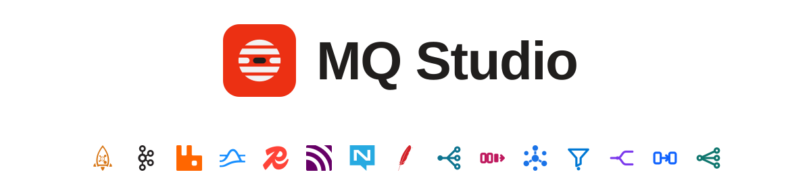
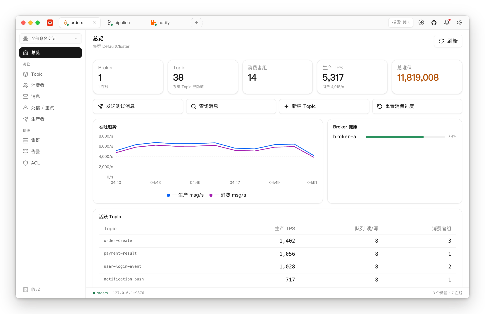
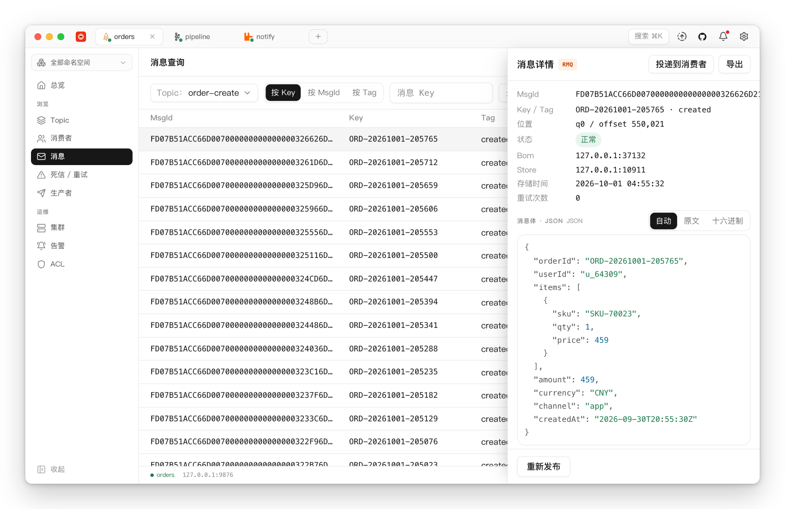
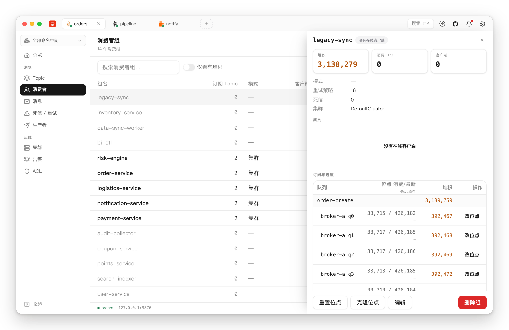
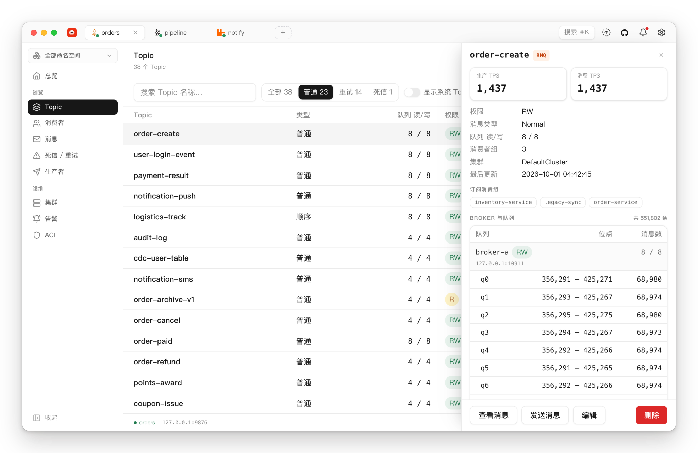
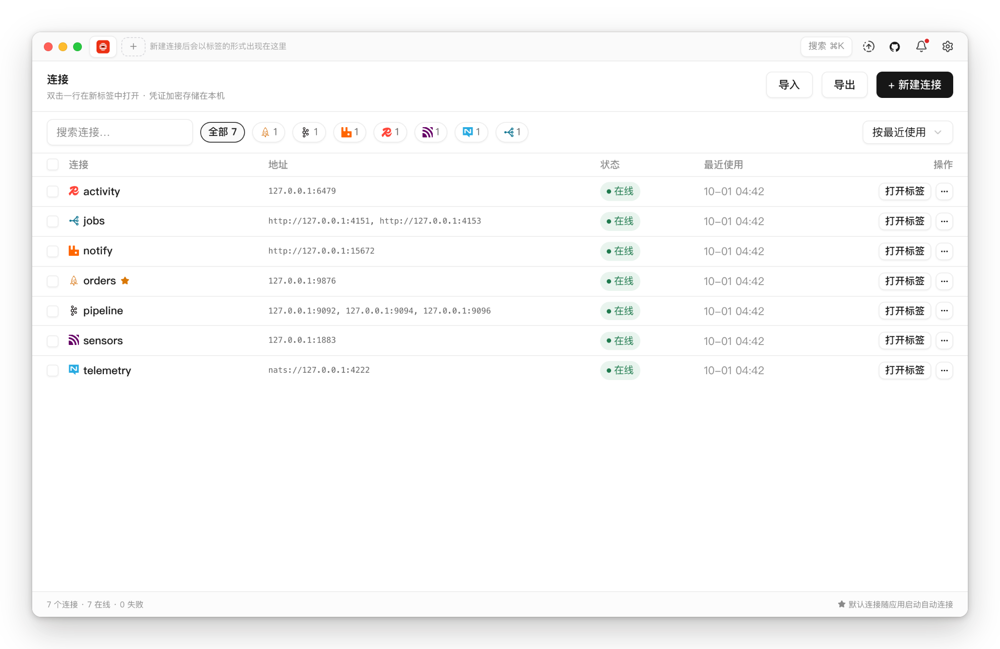
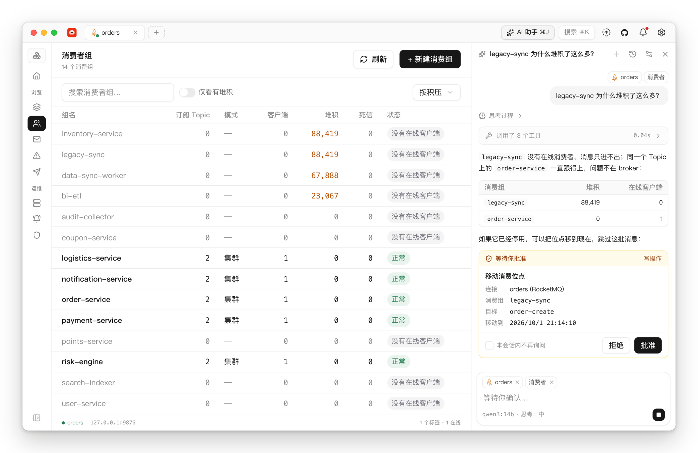

<div align="center">
  <picture>
    <source media="(prefers-color-scheme: dark)" srcset="docs/images/hero-dark.svg">
    
  </picture>

  <h3>一套界面，连接所有消息队列</h3>

  <p>RocketMQ、Kafka、RabbitMQ、Pulsar、Redis Stream、NATS 等消息队列的<br>Topic、消费者、消息与集群状态，都在一个本地优先的桌面应用里查看和操作，无需部署任何服务。</p>

  <p>
    <a href="https://github.com/amigoer/mq-studio/releases/latest"></a>
    <a href="https://github.com/amigoer/mq-studio/releases"></a>
    <a href="https://app.codecov.io/gh/amigoer/mq-studio"></a>
    <a href="LICENSE"></a>
  </p>

  <p>
    <a href="https://mq-studio.amigoer.com/"><strong>下载</strong></a>&nbsp;&nbsp;·&nbsp;&nbsp;
    <a href="docs/INSTALL.zh-CN.md">安装说明</a>&nbsp;&nbsp;·&nbsp;&nbsp;
    <a href="docs/DRIVERS.zh-CN.md">支持的中间件</a>&nbsp;&nbsp;·&nbsp;&nbsp;
    <a href="docs/ASSISTANT.zh-CN.md">AI 助手</a>&nbsp;&nbsp;·&nbsp;&nbsp;
    <a href="docs/MCP.zh-CN.md">给 agent 用</a>&nbsp;&nbsp;·&nbsp;&nbsp;
    <a href="README.md">English</a>
  </p>
</div>

<br>

<picture>
  <source media="(prefers-color-scheme: dark)" srcset="docs/images/readme/overview.dark.png">
  
</picture>

## 为什么用 MQ Studio

每一种消息队列都自带一个控制台：页面不同、叫法不同，而且每一个都是要部署、要值守的服务。MQ Studio 把它们放进同一套页面。

- **无需部署。** macOS、Windows、Linux 桌面应用，连接配置留在本机，凭证加密存储。
- **一套流程走遍所有中间件。** Topic、消费者、消息、集群与告警，不管连的是哪一种，用法都一样。
- **如实呈现每个中间件。** 每个连接都会上报端点真正能做什么，中间件没有的功能会说明原因，而不是假装有。
- **每个页面旁都有 AI 助手。** 问它某个消费组为什么落后，它会自己去 broker 上查；模型服务由你选，要改动什么都先等你批准。
- **也能交给 agent。** 同一个二进制通过 MCP 提供这些连接：默认只读，清空、删除要人确认，每个写操作都有记录。

## 细节一览

<table>
  <tr>
    <td width="50%" valign="top">
      
      <p><strong>消息。</strong>按 Key、Tag 或 ID 查询，打开消息体，看哪些消费组已经消费。</p>
    </td>
    <td width="50%" valign="top">
      
      <p><strong>消费积压。</strong>查清一个组为什么落后：逐队列的积压、在线的客户端，以及可以重置或克隆的位点。</p>
    </td>
  </tr>
  <tr>
    <td width="50%" valign="top">
      
      <p><strong>Topic。</strong>每个 Topic 的吞吐、队列与订阅关系，直接读自 Broker。</p>
    </td>
    <td width="50%" valign="top">
      
      <p><strong>连接。</strong>不管哪种中间件，所有集群都在一个列表里，每个都在自己的标签页中打开。</p>
    </td>
  </tr>
</table>

## 问 AI 助手



按 <kbd>⌘J</kbd>，问眼前看到的东西。AI 助手用和 MCP server 同一套工具读取 broker，根据读到的东西回答。

- **模型由你选。** Anthropic 的 API、任意 OpenAI 兼容服务（DeepSeek、通义千问、Kimi 等），或者通过 Ollama、LM Studio 跑在本机的模型。你同意之前，什么都不会发出去。
- **写操作等你批准。** 创建、发送、重投和移动位点会停在一张卡片上等你批准；清空和删除每次都要确认。每个写操作都有记录。
- **对话留在本机。** 加密保存，默认 30 天，可以在侧栏里搜索、重命名和导出。

设置方法、哪些东西会离开这台机器，以及出错时检查什么，见 [docs/ASSISTANT.zh-CN.md](docs/ASSISTANT.zh-CN.md)。

## 支持的中间件

| 中间件 | 版本 | 值得知道 |
| --- | --- | --- |
| RocketMQ | 4.x / 5.x | 填 NameServer 地址；消息轨迹、位点重置与克隆、ACL |
| Kafka | 3.x / 4.x | 位点重置、ACL、SCRAM 用户、配额、分区迁移 |
| RabbitMQ | 3.x / 4.x | 管理 API 加 AMQP；浏览会把读到的消息重新入队 |
| Pulsar | 3.x / 4.x | 租户与命名空间、游标移动、角色授权 |
| Redis Stream | 6.0+ | 待处理消息的认领与确认；支持哨兵与集群 |
| MQTT | 3.1.1 / 5.0 | 实时订阅；借 EMQX 这类管理 API 看客户端与会话 |
| NATS | 2.x | JetStream 的流与消费者，以及核心 NATS 订阅台 |
| ActiveMQ | Classic 5.x / 6.x<br>Artemis 2.x | 两种产品连接时自动区分；浏览不取走消息 |
| NSQ | 1.x | 汇总每个 nsqd 上的主题与通道；不能浏览，没有死信 |
| Amazon SQS | 托管服务 | 标准与 FIFO 队列；浏览走 ReceiveMessage |
| Google Pub/Sub | 托管服务 | 订阅、快照与回溯；没有积压数字 |
| Azure Service Bus | 托管服务 | 队列、主题与订阅规则；浏览用的是 peek |
| Amazon Kinesis | 托管服务 | 分片及其拆分合并关系；没有积压，浏览消耗读取额度 |
| IBM MQ | 9.1+ | 通过 mqweb REST 管理队列、主题与通道；消息体只有文本 |
| Solace PubSub+ | 10.x | 通过 SEMP v2 管理 Message VPN 与订阅；拿不到消息正文 |

每个驱动具体覆盖哪些功能、哪些协议兼容的系统可以直接用现有驱动连接，以及怎么申请新的驱动，见 [docs/DRIVERS.zh-CN.md](docs/DRIVERS.zh-CN.md)。

## 下载

在 **[mq-studio.amigoer.com](https://mq-studio.amigoer.com/)** 下载对应系统的安装包，或者去 [GitHub Releases](https://github.com/amigoer/mq-studio/releases)，那里还有 `SHA256SUMS.txt` 和全部历史版本。

| 系统 | 安装包 | 系统要求 |
| --- | --- | --- |
| macOS | `.dmg`，Apple 芯片与 Intel | macOS 12+ |
| Windows | `.exe`，x64 与 ARM64 | Windows 10+ |
| Linux | `.deb`、`.rpm` 与 `.AppImage`，x64 与 ARM64 | GTK 4 与 WebKitGTK 6.0：Ubuntu 24.04+、Debian 13+ |

macOS 版本尚未使用 Apple 开发者证书签名，首次打开需要多一步操作。这一步以及各平台的安装步骤见[安装说明](docs/INSTALL.zh-CN.md)。

## 给 agent 用

同一个二进制也是一个 [MCP](https://modelcontextprotocol.io) server，agent 可以直接使用你已经保存的连接：

```bash
claude mcp add mq-studio -- "/Applications/MQ Studio.app/Contents/MacOS/mq-studio" mcp
```

默认只读，写操作要在启动时放行：

- `--allow mutate` 放开创建、发送与移动位点；`--allow destructive` 再放开清空与删除。
- `--allow scratch=destructive` 只放宽一个连接，名字就是它在窗口里显示的名字。
- 清空和删除会先通过客户端向人确认，每个写操作都记在 `agent-audit.jsonl` 里。

详细说明、其他客户端的配置和完整的工具列表见 [docs/MCP.zh-CN.md](docs/MCP.zh-CN.md)。

## 从源码构建

需要 Go（版本以 `go.mod` 为准）、Node.js 20.19+ 或 22.12+、npm 与 [Wails 3 CLI](https://v3.wails.io)。

```bash
go install github.com/wailsapp/wails/v3/cmd/wails3@latest
make install
make dev
```

`make check` 跑的就是 CI 那一套检查。真实环境测试和新增驱动的步骤见 [CONTRIBUTING.zh-CN.md](CONTRIBUTING.zh-CN.md)。

## 更多

[架构说明](docs/ARCHITECTURE.md) · [路线图](docs/ROADMAP.zh-CN.md) · [更新日志](CHANGELOG.zh-CN.md) · [发版流程](RELEASE.md) · 有问题或需求，欢迎到 [GitHub Issues](https://github.com/amigoer/mq-studio/issues) 或 [linux.do](https://linux.do) 交流。

[Apache-2.0](LICENSE) © 2026 [amigoer](https://github.com/amigoer)
